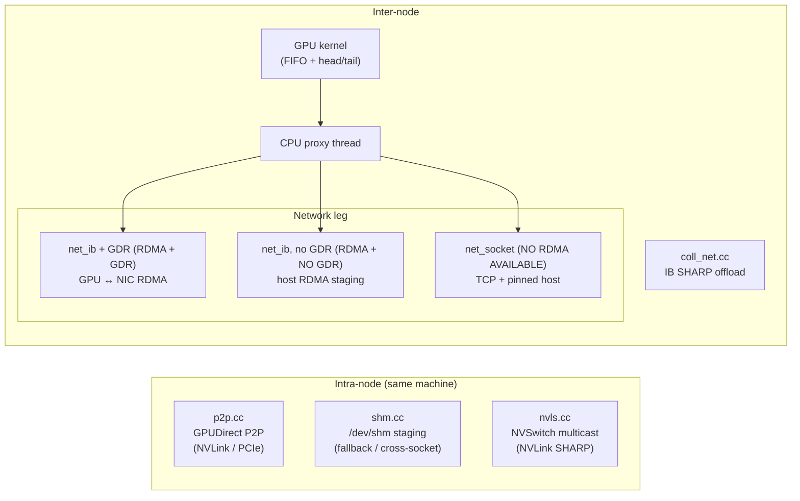

---

## layout: post

title: NCCL Paper Reading Notes

I'm starting a collection of notes related to [NCCL](https://github.com/nvidia/nccl) that are derived from the wonderful papers put out by the GPU Networking team at NVIDIA. **NOTE:** These are abridged notes that are not necessarily the most readable! They're mostly meant to just help me get my thoughts down - I'll do a follow-up where I turn them into a more readable blog format.

## [Demystifying NCCL](https://arxiv.org/abs/2507.04786)

- NCCL is open source + has documented API, but the internal design is unclear.
- This paper goes over:
  - Overview of the API
  - 3 modes (simple, LL, LL128)
  - Intra vs. Inter node data movement
  - Communication Algorithms (ring vs. tree)

---

### NCCL overview

NCCL is just MPI but for GPU-to-GPU interactions. The communication happens over NVLink, PCIe, or Infiniband/RoCE.

Note that each collective in NCCL requires an **algorithm** (path the data takes) paired with a **protocol** (how data chunks are packaged exactly).

#### The 4 kinds of NCCL functions

- **Communicator Management**: each GPU should define a communicator object, then call NCCL ops using said object.
  - `ncclCommInitAll` for 1 thread / all GPUs
  - `ncclCommInitRank` for 1 thread or process / 1 GPU
  - `ncclComm_t` is an **object** that takes resources. You should use `ncclCommDestroy` and `ncclCommAbort` to cleanup / cancel all operations respectively.

```cpp
// CASE 1: Single thread owns all GPUs
ncclComm_t comms[ngpus];
ncclCommInitAll(comms, ngpus, NULL);  // comms[i] bound to GPU i. Creates the object for everyone.

// CASE 2: Multi-process / multi-thread: each rank creates its own comm
ncclUniqueId uid;
if (rank == 0) ncclGetUniqueId(&uid);
// broadcast uid to all ranks (MPI_Bcast, shared memory, etc.)
ncclComm_t comm;
ncclCommInitRank(&comm, nranks, uid, rank);   // each rank creates own ncclComm_t object.

// Cleanup
ncclCommDestroy(comm);  // graceful: wait for in-flight ops to finish
ncclCommAbort(comm);    // immediate: cancel everything (e.g. on error)
```

- **Collective Operations**:
  - ncclBroadcast
  - ncclAllGather
  - ncclReduceScatter
  - ncclReduce + ncclAllReduce

```cpp
// Broadcast: root rank sends its buffer to every other rank
ncclBroadcast(sendbuff, recvbuff, count, ncclFloat, root, comm, stream);

// AllGather: each rank sends a chunk; everyone receives the full concatenation
ncclAllGather(sendbuff, recvbuff, count, ncclFloat, comm, stream);

// ReduceScatter: reduce across all ranks; each rank gets one slice of the result
ncclReduceScatter(sendbuff, recvbuff, count, ncclFloat, ncclSum, comm, stream);

// Reduce: combine into one result on a single root rank
ncclReduce(sendbuff, recvbuff, count, ncclFloat, ncclSum, root, comm, stream);

// AllReduce: reduce + broadcast — every rank gets the full result
ncclAllReduce(sendbuff, recvbuff, count, ncclFloat, ncclSum, comm, stream);
```

- **P2P Communication**:
  - ncclSend + ncclRecv

```cpp
// Point-to-point: rank 0 sends to rank 1 (must be paired send/recv)
if (rank == 0)
ncclSend(sendbuff, count, ncclFloat, /*dest=*/1, comm, stream);
if (rank == 1)
ncclRecv(recvbuff, count, ncclFloat, /*src=*/0, comm, stream);
```

- **Group Operations**:
  - Inefficient to run the same (op1 + op2 + op3)
  - You can use `ncclGroupStart` + `ncclGroupEnd`.
    - Defines a "group" of (specific send/recv calls) or (collectives)
      - Makes sure this is a **single NCCL launch**: reduces launch overhead + latency a lot!!!

```cpp
// Bad: each call = separate kernel launch (3x overhead)
ncclAllReduce(a, a_out, n, ncclFloat, ncclSum, comm, stream);
ncclAllReduce(b, b_out, n, ncclFloat, ncclSum, comm, stream);
ncclAllReduce(c, c_out, n, ncclFloat, ncclSum, comm, stream);

// Good: batched into one NCCL launch
ncclGroupStart();
ncclAllReduce(a, a_out, n, ncclFloat, ncclSum, comm, stream);
ncclAllReduce(b, b_out, n, ncclFloat, ncclSum, comm, stream);
ncclAllReduce(c, c_out, n, ncclFloat, ncclSum, comm, stream);
ncclGroupEnd();

// Works for mixed P2P too — NCCL can schedule sends/recvs in parallel
ncclGroupStart();
if (rank == 0) ncclSend(grad0, n, ncclFloat, 1, comm, stream);
if (rank == 1) ncclRecv(grad0, n, ncclFloat, 0, comm, stream);
if (rank == 1) ncclSend(grad1, n, ncclFloat, 2, comm, stream);
if (rank == 2) ncclRecv(grad1, n, ncclFloat, 1, comm, stream);
ncclGroupEnd();
```

#### 3 Ways to launch NCCL operations

- 1 CPU process / 1 GPU: each GPU has its own seperate process.
  - CPU can be scheduled on a local **NUMA domain**, which means better data locality and memory latency. Basically, for max performance, make sure you **force the CPU process to run on the CPU core(s) physically closest to that GPU**.
    - Basically, there's less distance between the CPU and corresponding GPU: data doesn't have to go through the slow interconnect between CPU sockets.

```cpp
// Launch N processes (e.g. mpirun -np 4 ./train)
int rank, nranks;
MPI_Comm_rank(MPI_COMM_WORLD, &rank);
MPI_Comm_size(MPI_COMM_WORLD, &nranks);

cudaSetDevice(rank);  // KEY: process 0 -> GPU 0, process 1 -> GPU 1, ...

ncclUniqueId uid;
if (rank == 0) ncclGetUniqueId(&uid);
MPI_Bcast(&uid, sizeof(uid), MPI_BYTE, 0, MPI_COMM_WORLD);

ncclComm_t comm;
ncclCommInitRank(&comm, nranks, uid, rank);

ncclAllReduce(sendbuff, recvbuff, count, ncclFloat, ncclSum, comm, stream);
ncclCommDestroy(comm);
```

- 1 CPU thread / 1 GPU: Single CPU Process, uses multiple threads to manage each GPU
  - Efficient intra-process memory sharing!!!
  - Lets you have **direct access to memory across ranks**:  GPU-GPU direct memory access! Less memcpy overhead

```cpp
// One process, one thread per GPU
ncclComm_t comms[ngpus];
cudaStream_t streams[ngpus];
ncclUniqueId uid;
ncclGetUniqueId(&uid);

void* worker(void* arg) {
int rank = *(int*)arg;
cudaSetDevice(rank);      // assigns a specific GPU to the CURRENT CPU thread
cudaStreamCreate(&streams[rank]);
ncclCommInitRank(&comms[rank], ngpus, uid, rank);

ncclAllReduce(sendbuff, recvbuff, count, ncclFloat, ncclSum,
comms[rank], streams[rank]);
return NULL;
}

pthread_t threads[ngpus];
int ranks[ngpus];
for (int i = 0; i < ngpus; i++) {
ranks[i] = i;
pthread_create(&threads[i], NULL, worker, &ranks[i]);
}
for (int i = 0; i < ngpus; i++) pthread_join(threads[i], NULL);
```

- 1 CPU thread / N GPUs: single thread launches multiple kernels
  - Sequential kernel launches, Less concurrency (launching kernels on ALL my GPUs in parallel)
  - Super simple, less CPU overhead, deterministic execution
  - Good for small projects since it's very easy to use, very deterministic!
  - Just need to launch a few kernels, then the overhead of the kernel launches can basically be hidden!

```cpp
// One process, one thread, all GPUs — simplest setup
int ngpus = 4;
ncclComm_t comms[ngpus];
cudaStream_t streams[ngpus];

ncclCommInitAll(comms, ngpus, NULL);  // comms[i] on GPU i, no UID needed

for (int i = 0; i < ngpus; i++) {
cudaSetDevice(i);    // current thread starts targeting GPU i
cudaStreamCreate(&streams[i]);
ncclAllReduce(sendbuff, recvbuff, count, ncclFloat, ncclSum,
comms[i], streams[i]);  // launched one after another
}
for (int i = 0; i < ngpus; i++) cudaStreamSynchronize(streams[i]);
```

#### Communication via Channels (note that Channels === CUDA Blocks === SMs)

- NCCL basically just **launches threadblocks on SMs that only do communication.** Each collective decomposes the data into "communication channels" which are just CUDA blocks. Each block runs on its own SM and handles an independent part of the work.
- NCCL Communication is between 3 things: GPU, CPU, NIC.
  - GPU: executes ops (reductions are what NCCL cares about), moves data between buffers
  - CPU: launches kernels
  - NIC: get packets across nodes
- Background: **Proxy Thread** is needed in inter-node transfers. This is just a **background CPU thread** whose job is to **manage ops between the GPU and NIC**.
  - Note that it is NOT actually touching the data itself; it's just managing the DMA engines — i.e. telling the NIC to pull data directly from GPU memory via a direct PCIe hardware copy.

**Order of operations:**

1. GPU finishes computation and puts data into a dedicated VRAM buffer
2. GPU writes a tiny message into a CPU FIFO queue saying "Hey, I just finished, my data to send is in GPU memory at address 0x7f000"
3. Proxy thread is running a fast, constant loop checking the shared CPU FIFO. The second it sees the GPU's message...
4. Proxy thread immediately calls the network driver (IBVerbs, TCP socket, etc.), basically telling the NIC "Hey Mr. NIC, go to GPU memory address 0x7f000 and send that data over the network wire"
5. The NIC uses GPUDirect RDMA to reach directly across the PCIe bus, grab the data from GPU memory, and stream it onto the network wire.
  - PCIe is ~64 GB/s; NICs transfer at 400 Gb/s (50 GB/s), so there's no bottleneck.

- **The Channel vs. Chunk Size Tradeoff (i.e. the "Using more SMs vs. Filling the NIC" tradeoff)**
  - Let's say you want to transfer a 4 MB tensor.
    - If you use 2 channels, each channel/block/SM is transferring 2 MB of data
    - If you use 16 channels, each channel/block/SM is transferring 256 KB of data
    - **Channels goes up** means **chunk_to_send goes down**.
  - Lower Channels === Higher Chunks to send
    - Pros: Since your NIC has a fixed internal buffer size (512 KB), you ideally want to send completely full 512 KB packets. You can saturate this buffer!
    - Cons: You have fewer thread blocks working: so there's less parallelism! The GPU is underutilized as we're waiting for a few SMs/blocks to finish.
  - More Channels === Lower Chunks to send
    - Pros: You're launching 16 thread blocks and using 16 SMs: more processing speed!
    - Cons: per-block chunk size shrinks, so you're sending packets smaller than 512 KB. The proxy thread is transmitting a partially filled network buffer that harms your network throughput!
- When you fuse P2P ops with `ncclGroupStart` and `ncclGroupEnd`, NCCL assigns each transfer to a separate block so they can theoretically run in parallel. This is *task-level parallelism*.

### The 3 Communication Protocols (i.e. bandwidth v latency tradeoff)

#### Simple

- Designed for **high bandwidth** and **large messages**, i.e. moving MASSIVE (512 KB) data chunks at once.
- Lets you saturate NIC bandwidth with large data chunks filling the packet size!
- But... there's an implicit **memory fence**: if the receiver **must** get 100% of the data chunk before touching the data.
  - Overhead is huge for small messages: most time spent syncing. HIgh latency (6us latency per-hop) for small payloads.

#### Low Latency

- Designed for **low latency** and extremely **small messages**
- 1us latency per hop (this is done using the **flag trick!**)- Low bandwidth: overhead of sending flag payloads.
- KEY TRICK: NCCL splits your data into (4-byte data, 4-byte flag) payloads. **The flag signals that this 4-byte tile is good to be touched by the receiver!**
  - The **moment the receiver NIC sees the flag slot filled**, it knows that data is fresh and valid. There's no waiting for an expensive memory fence!
- KEY TRICK 2: There's no GPUDirect RDMA. We use an **intermediate staging buffer** in **CPU host memory**. This nukes your bandwidth! But this way the CPU proxy thread can super-quickly poll when data is ready to be sent. Polling over GPU memory and PCIe (like normal) is much slower!

#### LL128

- Intermediate! We send in chunks of (120-byte data + 8-byte flag). This is a hardware cache line!
- BUT... it has strict hardware requirements (PCIe + motherboard compatibility with 128-byte atomic writes). Disabled automatically if hardware isn't compatible to avoid data corruption.

#### Selecting Protocol

- NCCL auto selects based on message size heuristics
- Can also force using environment variable: `NCCL_PROTO=Simple ./my_app` or `NCCL_PROTO=LL128 ./my_app`.
- Can also set in PyTorch:

```python
import os
import torch
import torch.distributed as dist

# 1. CRITICAL: Set the NCCL Protocol BEFORE initializing the process group
# Options: "Simple", "LL", "LL128"
os.environ["NCCL_PROTO"] = "Simple"

# Optional: Turn on NCCL debugging to visually confirm which protocol is selected
os.environ["NCCL_DEBUG"] = "INFO"
os.environ["NCCL_DEBUG_SUBSYS"] = "ENV,INIT"

# 2. Initialize your standard distributed backend
dist.init_process_group(backend="nccl")

local_rank = int(os.environ["LOCAL_RANK"])
torch.cuda.set_device(local_rank)

# Example tensor payload
tensor = torch.randn(1024, 1024, device=f"cuda:{local_rank}")

# This communication will now strictly use the protocol defined in os.environ
dist.all_reduce(tensor)
print(f"Rank {local_rank} completed All-Reduce using forced NCCL_PROTO.")
```

You will see:

```
# Example console output log:
NCCL INFO Cuda dev 0 - NVLink-connected to dev 1
NCCL INFO Channel 00/04 : 0 1
NCCL INFO Using protocol Simple  <-- [Confirms your manual choice is active]
```

---

### Transport Layer (i.e. Hardware)

**Table II:** NCCL Communication Characteristics and Transports


|                       | Intra-Node                               | Inter-Node                                                |
| --------------------- | ---------------------------------------- | --------------------------------------------------------- |
| Transport             | P2P `p2p.cc` SHM `shm.cc` NVLS `nvls.cc` | NET `net_ib.cc` NET `net_socket.cc` COLLNET `coll_net.cc` |
| Physical Interconnect | NVLink PCIe                              | InfiniBand RoCE TCP/IP (Socket)                           |
| Optimizations         | GPUDirect P2P `P2P_DIRECT`               | GPUDirect RDMA                                            |





#### Intra-node

- `p2p.cc`  handles p2p if GPUs can directly read/write to peer VRAM (NVLink) (CUDA UVA)
  - P2P_DIRECT mode: if ranks are in the same process, much faster (IPC handles not needed, no intermediate FIFO buffer between GPUs are needed)
  - If P2P_DIRECT not enabled (multiprocess), you need IPC/cuMem sharable handles to map peer memory. Data is routed through an intermediate FIFO buffer (extra copy)
- `shm.cc`  is if p2p not available/is slow: GPUs must stage data in shared RAM to communicate (each side copied over PCIe)
- `nvls.cc` is if you have NVSwitch, which lets you do SHARP accelerated reductions

#### Inter-node

Note that all inter-node operations require 3 key pieces: (1) GPU that runs NCCL kernels, (2) CPU proxy thread that posts network NIC sends and receives, (3) network fabric/NIC hardware to move bytes using TCP/RDMA

- `net_ib.cc` is if you have an RDMA-capable network like IB or RoCE
- `net_socket.cc` is if you don't have RDMA and need to use TCP sockets instead
  - Works by CUDA pinning memory as intermediate buffers
  - GPU -> pinned host buffer -> proxy thread sends over TCP -> receiver pinned host buffer -> GPU #2
- `coll_net.cc` is if your inter-node network switch has accelerated collective ops

##### ++Internode Summary:++

- RDMA-capable network + GPUDirect
  - `net_ib.cc`
  - IB with RDMA == GPU > NIC <> NIC > GPU
- RDMA-capable network + no GPUDirect
  - `net_ib.cc`
  - IB without RDMA == GPU > pinned host > RDMA write > remote host > GPU
    - Basically, instead of doing RDMA on GPU memory, you do RDMA on CPU host memory.
- No RDMA
  - `net_socket.cc` 
  - Socket == GPU > host > TCP > remote host > GPU

Note on **CUDA pinned memory**: When you use `cudaHostAlloc` or `cudaMallocHost`: allows for GPU DMA to read/write over PCIe more easily.

Note on **CPU Proxy Thread**: The CPU proxy does NOT move data, it's basically just the coordinator between the GPU buffers and the network plugin.

---

### NCCL's Collective Algorithms

> **TODO:** Review Section V-D — explains how NCCL kernels work exactly!

- Different topologies:
  - Ring Topology: Send data to neighbors only
  - Tree Topology: look at who is my parent/child and communicate via a tree.
  - Double Binary Tree
- Choice of algorithm (i.e. ring vs. tree) depends on:
  - Collective
  - Message Size
  - Topology
- Algorithms for doing collectives  (??? review what all these look like):
  - Ring
  - Tree
  - CollNet Direct (SHARP network compute available)
    - A2A comms within node????
  - CollNet Chain
    - Linear GPUs??? Reductions up the chain and broadcasts down
  - NVLS (NVSwitch systems w/ SHARP)
  - NVLS Tree (?????)
  - PAT (new, but low adoption)
- Collectives are composed from low-level comm primitives. **THESE ARE AFFECTED BY PROTOCOL**
  - send
  - recv
  - recvReduceSend: recv, reduce on local buffer, send to next
  - recvCopySend
  - recvReduceCopySend
- Data is split independently by channel/block/SM:

>

