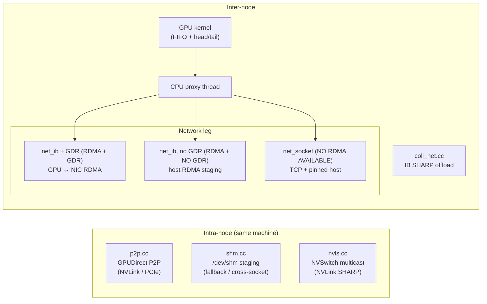

I'm starting a series of posts where I turn my existing notes on [NCCL](https://github.com/nvidia/nccl) into blog format. I'm relatively new to technical writing like this, so if you have feedback please feel free to shoot me an email at willychan2022@gmail.com.

This post is a blog-formatting of my notes on the [Demystifying NCCL paper](https://arxiv.org/abs/2507.04786), published by NVIDIA's networking team.

> **TL;DR:** NCCL is fully open source and the API is documented, but the internal design is unclear. This paper goes over (1) an overview of the API, (2) the 3 modes (simple, LL, LL128), (3) intra vs. internode data movement, and (4) communication algorithms (e.g. ring vs. tree).

## Contents
{: .no_toc }

* TOC
{:toc}

## Overview of the NCCL API

NCCL is a lot like MPI, but specializes in GPU-to-GPU interactions. The communication happens over NVLink, PCIe, or Infiniband/RoCE.

### The 4 Types of NCCL Functions

#### Communicator Management

Each participating GPU has a local `ncclComm_t` handle representing its endpoint in a communicator.

- `ncclCommInitAll` for 1 process controlling all GPUs.
- `ncclCommInitRank` for N processes for each of the N GPUs.
- `ncclComm_t` is an **object** representing one GPU in one communicator: all of the communicator handles collectively represent one NCCL "communicator". You should use `ncclCommDestroy` and `ncclCommAbort` to cleanup these objects eventually.

**`ncclCommInitAll`:** One process owns communicator handles for every GPU. To launch a collective, the application typically loops over the GPUs and issues one NCCL call per GPU.
```cpp
// CASE 1: we run ONE process that is designed to control every rank. This single process runs the following:
ncclComm_t comms[ngpus];
ncclCommInitAll(comms, ngpus, NULL);  // comms[i] is the communicator handle for GPU i. This single process owns all 4 communicator handles.

// To launch a collective op for all N GPUs, this single process calls the op like so:
ncclGroupStart();

for (int i = 0; i < 4; i++) {
    cudaSetDevice(i);
    ncclAllReduce(send[i], recv[i], count, ncclFloat, ncclSum,
                  comms[i],
                  streams[i]);
}

ncclGroupEnd();  // prevents blocking: GPU 0 will call allReduce, but then get stuck waiting for this process to call allReduce for GPU 1, which it cannot do since GPU 0 is still waiting. The group tells NCCL to call all 4 allReduces all at once. Grouping is mainly useful when one thread is issuing all NCCL operations.
```

**`ncclCommInitRank`:** one process generates a `ncclUniqueId`, broadcasts it to all participating processes, and every process calls `ncclCommInitRank(...)` with the same ID and its own rank.
```cpp
// CASE 2: we run N processes, with each rank meant to launch NCCL ops for 1 of our ranks. Each individual process runs the following:
ncclUniqueId uid;
ncclComm_t comm;
if (rank == 0) ncclGetUniqueId(&uid); 
// *broadcast uid to all ranks (MPI_Bcast, shared memory, etc.)*    <-- we need a UID to tell us who is in the communicator group! It's like the meeting ID.
ncclCommInitRank(&comm, nranks, uid, rank);

// Now each process has exactly one communicator handle:
// Process 0
//     comm  <-- GPU0

// Process 1
//     comm  <-- GPU1

// Process 2
//     comm  <-- GPU2

// Process 3
//     comm  <-- GPU3


// To launch a collective:
ncclAllReduce(..., comm, stream);   // every process MUST CALL THE SAME FUNCTION using its own communicator handle.

// Cleanup
ncclCommDestroy(comm);  // graceful: wait for in-flight ops to finish
ncclCommAbort(comm);    // immediate: cancel everything (e.g. on error)
```

#### Collective Operations

- `ncclBroadcast`
- `ncclAllGather`
- `ncclReduceScatter`
- `ncclReduce` + `ncclAllReduce`

> Note that each collective in NCCL requires an **algorithm** (path the data takes) paired with a **protocol** (how data chunks are packaged exactly).

```cpp
// Broadcast: root rank sends its buffer to every other rank
ncclBroadcast(sendbuff, recvbuff, count, ncclFloat, root, comm, stream);

// AllGather: each rank sends a chunk; everyone receives the full concatenation
ncclAllGather(sendbuff, recvbuff, count, ncclFloat, comm, stream);

// ReduceScatter: reduce across all ranks; each rank gets one slice of the result
ncclReduceScatter(sendbuff, recvbuff, count, ncclFloat, ncclSum, comm, stream);

// Reduce: combine into one result on a single root rank
ncclReduce(sendbuff, recvbuff, count, ncclFloat, ncclSum, root, comm, stream);

// AllReduce: reduce + broadcast — every rank gets the full result
ncclAllReduce(sendbuff, recvbuff, count, ncclFloat, ncclSum, comm, stream);
```

#### P2P Communication

- `ncclSend` + `ncclRecv`

```cpp
// Point-to-point: rank 0 sends to rank 1 (must be paired send/recv)
if (rank == 0)
ncclSend(sendbuff, count, ncclFloat, /*dest=*/1, comm, stream);
if (rank == 1)
ncclRecv(recvbuff, count, ncclFloat, /*src=*/0, comm, stream);
```

#### Group Operations

- Batch multiple NCCL API calls into a single submission phase.
- NCCL records the operations between `GroupStart()` and `GroupEnd()`.
- At `GroupEnd()`, NCCL issues the queued operations together.
- Mostly used when one thread controls multiple GPUs (to avoid deadlock and coordinate collectives).

Without grouping:
```
GPU0 launch
(waiting...)

GPU1 launch

GPU2 launch
```

Grouping lets NCCL see all the allreduces at the very beginning:
```cpp
ncclGroupStart();

for (int i = 0; i < ngpus; i++) {
    cudaSetDevice(i);
    ncclAllReduce(..., comms[i], streams[i]);
}

ncclGroupEnd();
```

### 3 Common Ways to Launch NCCL Operations

#### 1 CPU thread / N GPUs

Single thread launches kernels on each rank.

- Super simple, less CPU overhead, deterministic execution
- Good for small projects since it's very easy to use, very deterministic!
- **Just need to launch a few kernels, then the overhead of the kernel launches can basically be hidden!**

```cpp
// One process, one thread, all GPUs — simplest setup
int ngpus = 4;
ncclComm_t comms[ngpus];
cudaStream_t streams[ngpus];

ncclCommInitAll(comms, ngpus, NULL);  // comms[i] on GPU i, no UID needed

ncclGroupStart();

for (...) {
    ...
    ncclAllReduce(...);
}

ncclGroupEnd();
```

#### 1 CPU process / 1 GPU

Each GPU has its own separate process.

- CPU can be scheduled on a local **NUMA domain**, which means better data locality and memory latency. Basically, for best performance, make sure you **force the CPU process to run on the CPU core(s) physically closest to that GPU**.
- Basically, there's less distance between the CPU and corresponding GPU: launch data doesn't have to go through the slow interconnect between CPU sockets.

```cpp
// Launch N processes (e.g. mpirun -np 4 ./train)
int rank, nranks;
MPI_Comm_rank(MPI_COMM_WORLD, &rank);
MPI_Comm_size(MPI_COMM_WORLD, &nranks);

cudaSetDevice(rank);

ncclUniqueId uid;
if (rank == 0) ncclGetUniqueId(&uid);                                         // every rank has the same meeting uid
MPI_Bcast(&uid, sizeof(uid), MPI_BYTE, 0, MPI_COMM_WORLD);

ncclComm_t comm;
ncclCommInitRank(&comm, nranks, uid, rank);                                   // ncclCommInitRank call on each rank

ncclAllReduce(sendbuff, recvbuff, count, ncclFloat, ncclSum, comm, stream);   // every rank simultaneously calls the collective
ncclCommDestroy(comm);
```

#### 1 process, N CPU threads (1 thread / GPU)

Single CPU process uses multiple threads to manage each GPU.

- One process creates one worker thread per GPU.
- Threads share the same address space, making CPU-side coordination simpler.
- Avoids MPI while still allowing one thread to manage each GPU independently.
- Can issue NCCL operations concurrently from different CPU threads.

```cpp
// Here, I assume we have 1 process with N threads. Each of the N threads controls 1 GPU, so all N GPUs are controlled by N threads.
ncclComm_t comms[ngpus];
cudaStream_t streams[ngpus];
ncclUniqueId uid;
ncclGetUniqueId(&uid);      // we still need a UID here: each thread needs to "rendezvous" into the same communicator group.

// What each individual thread will be running:
void* worker(void* arg) {
  int rank = *(int*)arg;
  cudaSetDevice(rank);
  cudaStreamCreate(&streams[rank]);
  ncclCommInitRank(&comms[rank], ngpus, uid, rank);           // each thread is treated like a process: they call ncclCommInitThread and then the respective collective.

  ncclAllReduce(sendbuff, recvbuff, count, ncclFloat, ncclSum,
  comms[rank], streams[rank]);
  return NULL;
}

// Loop through and create N threads. These N threads execute the worker() code above, then complete and join at the end.
pthread_t threads[ngpus];
int ranks[ngpus];
for (int i = 0; i < ngpus; i++) {
  ranks[i] = i;
  pthread_create(&threads[i], NULL, worker, &ranks[i]);
}
for (int i = 0; i < ngpus; i++) pthread_join(threads[i], NULL);
```

## The 3 Communication Protocols (bandwidth vs. latency)

### Overview of NCCL's Communication Kernels

> **Important:** Channel === CUDA thread block scheduled to 1 SM's worth of work.

- NCCL basically just **launches threadblocks on SMs that only do communication.** Each collective decomposes the data into "communication channels" which are just CUDA blocks. Each block runs on its own SM and handles an independent part of the work.
- NCCL Communication is between 3 things: GPU, CPU, NIC.
  - GPU: executes ops (reductions are what NCCL cares about), moves data between buffers
  - CPU: launches kernels
  - NIC: get packets across nodes
- Background: **Proxy Thread** is needed in inter-node transfers. This is just a **background CPU thread** whose job is to **manage ops between the GPU and NIC**.
  - Note that it is NOT actually touching the data itself; it's just managing the DMA engines — i.e. telling the NIC to pull data directly from GPU memory via a direct PCIe hardware copy.

**Order of operations:**

1. GPU finishes computation and puts data into a dedicated VRAM buffer
2. GPU writes a message into a CPU FIFO queue saying "Hey, I just finished, my data to send is in GPU memory at address 0x7f000"
3. Proxy thread is running a fast, constant loop checking/monitoring the shared CPU FIFO. The second it sees the GPU's message...
4. Proxy thread immediately calls the network driver (IBVerbs, TCP socket, etc.), basically telling the NIC "Hey Mr. NIC, go to GPU memory address 0x7f000 and send that data over the network wire"
5. The NIC uses GPUDirect RDMA to reach directly across the PCIe bus, grab the data from GPU memory, and stream it onto the network wire.

- **The Channel vs. Chunk Size Tradeoff (i.e. the "Using more SMs vs. Filling the NIC" tradeoff)**
  - Let's say you want to transfer a 4 MB tensor.
    - If you use 2 channels, each channel/block/SM is transferring 2 MB of data
    - If you use 16 channels, each channel/block/SM is transferring 256 KB of data
    - **Channels goes up** means **chunk_to_send goes down**.
  - Lower Channels === Higher Chunks to send
    - Pros: Large transfers tend to utilize the network better.
    - Cons: You have fewer thread blocks working: i.e. less worker thread blocks preparing data to be put on the wire i.e. less parallelism! The GPU is underutilized as we're waiting for a few SMs/blocks to finish.
  - More Channels === Lower Chunks to send
    - Pros: You're launching 16 thread blocks and using 16 SMs: more GPU parallelism! There's better SM utilization.
    - Cons: If the data chunks being sent are too small, the communication overhead reduces our overall bandwidth.


### Simple Protocol
We split data into massive (512 KB) data chunks. Our channels/SMs each put massive chunks onto the wire.

- Designed for **high bandwidth** and **large messages**
- Pros: Lets you saturate NIC bandwidth with large data chunks
- Cons: There's an implicit **memory fence**: the receiver **must** get 100% of the data chunk before touching the data. Thus, the overhead is huge for small messages: most time is spent syncing. High latency (6us latency per-hop) for small payloads.

### Low Latency (LL) Protocol
Simple has too much latency. What if we have smaller message sizes, i.e. we're underutilizing the bandwidth? And instead of a memory fence telling us that some massive chunk of data is available to use, we use *flag-based* synchronization?

The key trick is that NCCL splits your data into [===4-byte data===, ===4-byte flag===] payloads. **The flag signals that this 4-byte tile is good to be touched by the receiver!** The **moment the receiver GPU kernel sees the flag slot filled**, it knows that data is fresh and valid. There's no waiting for a large chunk before beginning processing!

Another (smaller) trick: instead of GPUDirect RDMA, we have to use an **intermediate staging buffer** in **CPU host memory**. This nukes your bandwidth! But this way the CPU proxy thread can super-quickly poll when data is ready to be sent. Polling over GPU memory and PCIe (like normal) is much slower!

- Designed for **low latency** and extremely **small messages**
- Pros: 1us latency per hop (this is done using the **flag trick!**) 
- Cons: Low bandwidth: overhead of sending flag payloads.

### LL128 Protocol
Goldilocks: maybe we need something in between high-bandwidth and low-latency. How about we send chunks of [===120-byte data===, =8-byte flag=]. This is a hardware cache line!

Note that *inter-node*, we do not do the 128-byte unit trick: we aggregate them into larger data chunks [128, 128, 128, ...] before the proxy/NIC sends them (aggregating LOTs of 128-byte units). But in *intra-node* NVLink, we have fine-grained pipelining thanks to the [120, 8] byte units.

Pros: This way we can get to ~95% of peak bandwidth but with the advantages of flag-based synchronization/fine-grained pipelining within a node. 
Cons: We have strict hardware requirements (atomic 128-byte writes enabled)

### Selecting a Protocol

- NCCL auto selects based on message size heuristics
- Can also force using environment variable: `NCCL_PROTO=Simple ./my_app` or `NCCL_PROTO=LL128 ./my_app`.
- Can also set in PyTorch:

```python
import os
import torch
import torch.distributed as dist

# 1. CRITICAL: Set the NCCL Protocol BEFORE initializing the process group
# Options: "Simple", "LL", "LL128"
os.environ["NCCL_PROTO"] = "Simple"

# Optional: Turn on NCCL debugging to visually confirm which protocol is selected
os.environ["NCCL_DEBUG"] = "INFO"
os.environ["NCCL_DEBUG_SUBSYS"] = "ENV,INIT"

# 2. Initialize your standard distributed backend
dist.init_process_group(backend="nccl")

local_rank = int(os.environ["LOCAL_RANK"])
torch.cuda.set_device(local_rank)

# Example tensor payload
tensor = torch.randn(1024, 1024, device=f"cuda:{local_rank}")

# This communication will now strictly use the protocol defined in os.environ
dist.all_reduce(tensor)
print(f"Rank {local_rank} completed All-Reduce using forced NCCL_PROTO.")
```

You will see:

```
# Example console output log:
NCCL INFO Cuda dev 0 - NVLink-connected to dev 1
NCCL INFO Channel 00/04 : 0 1
NCCL INFO Using protocol Simple  <-- [Confirms your manual choice is active]
```

---

## Transport Layer (Hardware)

**Table II:** NCCL Communication Characteristics and Transports

| | Intra-Node | Inter-Node |
| --- | --- | --- |
| Transport | P2P `p2p.cc`, SHM `shm.cc`, NVLS `nvls.cc` | NET `net_ib.cc`, NET `net_socket.cc`, COLLNET `coll_net.cc` |
| Physical Interconnect | NVLink, PCIe | InfiniBand, RoCE, TCP/IP (Socket) |
| Optimizations | GPUDirect P2P `P2P_DIRECT` | GPUDirect RDMA |





### Intra-node

- `p2p.cc`  handles p2p if GPUs can directly read/write to peer VRAM (NVLink) (CUDA UVA)
  - P2P_DIRECT mode: if ranks are in the same process, much faster (IPC handles not needed, no intermediate FIFO buffer between GPUs are needed)
  - If P2P_DIRECT not enabled (multiprocess), you need IPC/cuMem sharable handles to map peer memory. Data is routed through an intermediate FIFO buffer (extra copy)
- `shm.cc`  is if p2p not available/is slow: GPUs must stage data in shared RAM to communicate (each side copied over PCIe)
- `nvls.cc` is if you have NVSwitch, which lets you do SHARP accelerated reductions

### Inter-node

Note that all inter-node operations require 3 key pieces: (1) GPU that runs NCCL kernels, (2) CPU proxy thread that posts network NIC sends and receives, (3) network fabric/NIC hardware to move bytes using TCP/RDMA

- `net_ib.cc` is if you have an RDMA-capable network like IB or RoCE
- `net_socket.cc` is if you don't have RDMA and need to use TCP sockets instead
  - Works by CUDA pinning memory as intermediate buffers
  - GPU -> pinned host buffer -> proxy thread sends over TCP -> receiver pinned host buffer -> GPU #2
- `coll_net.cc` is if your inter-node network switch has accelerated collective ops

#### Internode Summary

- RDMA-capable network + GPUDirect
  - `net_ib.cc`
  - IB with RDMA == GPU > NIC <> NIC > GPU
- RDMA-capable network + no GPUDirect
  - `net_ib.cc`
  - IB without RDMA == GPU > pinned host > RDMA write > remote host > GPU
    - Basically, instead of doing RDMA on GPU memory, you do RDMA on CPU host memory.
- No RDMA
  - `net_socket.cc` 
  - Socket == GPU > host > TCP > remote host > GPU

Note on **CUDA pinned memory**: When you use `cudaHostAlloc` or `cudaMallocHost`: allows for GPU DMA to read/write over PCIe more easily.

Note on **CPU Proxy Thread**: The CPU proxy does NOT move data, it's basically just the coordinator between the GPU buffers and the network plugin.

---

## NCCL's Collective Algorithms

**Important Note:** Stay tuned for part 2, where I dive deeper into the actual algorithm that NCCL uses for its (non-SHARP) collectives. Here I just give a very high-level overview.

There are **six core algorithms** that NCCL supports:

| Algorithm | Core Idea | Where it Helps |
| --- | --- | --- |
| Ring | GPUs arranged in a logical ring; data is pipelined around the ring | Maximum bandwidth, large messages |
| Tree | Hierarchical reduce + broadcast tree | Low latency, small messages |
| CollNet Direct | Hierarchical collective where GPUs communicate through a network collective engine (e.g., SHARP) | Multi-node systems with SHARP-capable networks |
| CollNet Chain | Hierarchical collective where GPUs are arranged as chains within nodes and use network acceleration between nodes | Multi-node systems, bandwidth-oriented transfers |
| NVLS | Uses NVSwitch/NVLink SHARP hardware to perform collective operations inside a node | NVSwitch-based multi-GPU systems |
| NVLS Tree | Tree-style algorithm accelerated by NVLS hardware | NVSwitch systems requiring lower latency |

Ring and Tree are software algorithms (general purpose). CollNet (internode SHARP) and NVLS (intranode SHARP) are separate algorithm families that account for special hardware that lets you do reductions in the network switch.

- **Ring** — high bandwidth, large messages
- **Tree** — low latency, small messages

Collectives: AllReduce, Broadcast, Reduce, ReduceScatter, AllGather  
Protocols: Simple, LL, LL128  
Algorithms: Ring, Tree, CollNet Direct, CollNet Chain, NVLS, NVLS Tree

### Primitives

These high-level collectives are composed of low-level primitives (which allows for flexibility):

- `send`, `recv`, `recvReduceSend`, `recvCopySend`, `recvReduceCopySend`
- Syncing, buffer management, and transfer granularity vary depending on the protocol (Simple / LL / LL128)

NCCL kernels are launched with a grid `(nChannels, 1, 1)`. `nChannels` is the number of active communication channels for the operation.

- `blockIdx.x` corresponds to exactly one communication channel
- Within a block, NCCL uses `MIN` to `MAX_NTHREADS`; `plan->threadPerBlock` sets the number of threads used in a block
- Mapping from `blockIdx.x` → channel ID
- **Warp specialization:** warp 0 does communicator metadata, warp 1 loads channel-specific data; the rest of the warps do communication/computation
- Threads in those comm/comp warps are carefully coordinated to not diverge: they do send/reduce/copy

**Non-pipelined:** Ring AllReduce, Ring AllGather, Ring ReduceScatter (each GPU must complete all tasks in one iteration)

- Example Ring AllReduce: implement reduce-scatter with send/recvReduce primitives, then do an all-gather with the same primitives

**Pipelined:** Tree AllReduce, Ring Broadcast, Ring Reduce

Low-level comm primitives (**these are affected by protocol**):

- `send`
- `recv`
- `recvReduceSend`: recv, reduce on local buffer, send to next
- `recvCopySend`
- `recvReduceCopySend`

Data is split independently by channel/block/SM.
