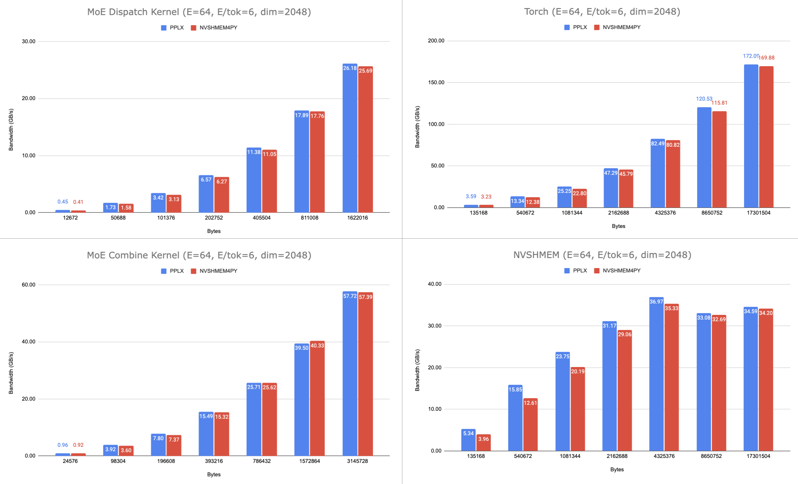

# NVSHMEM4py x Perplexity MoE Kernel Integration (Part 1)

## Overview

This is a summary document describing the NVSHMEM4PY integration into the pplx-kernels project:

<ol>
  <li>Use of Official NVSHMEM Python bindings</li>
  <li>Torchrun support with NVSHMEM4py</li>
  <li>Dynamic linking with NVSHMEM</li>
</ol>

<!-- Most importantly however, this second iteration MR proposes a framework for *uniform tensor allocation* through NVSHMEM4py. Thus far Perplexity still manually calls methods like *nvshmem_malloc* through C++, but this MR proves that it's possible to do such function calls through native NVSHMEM4Py instead: the idea is that in a researcher workflow, it would be preferable to do everything through Python rather than context-switch between C++ and Python with custom bindings that might go out of date. -->

<!-- Luckily, nvshmem4py supports a *.data_ptr()* method that makes it really easy to thread through a data buffer that 1) lives on the GPU and 2) is allocated through NVSHMEM and thus lives in the symmetric heap on all devices. -->


## Running Tests (Quick Reference)

<b>Running Sanity Checks (test_nvshmem.py)</b>

Note that there is a separate branch (cmake_dl_and_nvshmem_malloc_full_integration) that requires torchrun instead of the native pytest framework.

```Unix
pytest -svx --tb=short tests tests/test_nvshmem.py
```

<b>Running All-To-All Checks (test_all_to_all.py)</b>

```Unix
pytest -svx --tb=short tests tests/test_all_to_all.py::test_all_to_all_4_gpu
```

<b>Running Benchmark (bench_all_to_all.py)</b>

```Unix
python3 -m tests.bench_all_to_all
```

## 📈 Performance Study

### System Configuration

All of the below tests were run using the provided benchmark script on a DGX system with 8 H100 GPUs.

```Unix
name,                memory.total [MiB], driver_version, compute_cap
NVIDIA H100 80GB HBM3,   81559 MiB,       535.216.03,       9.0
NVIDIA H100 80GB HBM3,   81559 MiB,       535.216.03,       9.0
NVIDIA H100 80GB HBM3,   81559 MiB,       535.216.03,       9.0
NVIDIA H100 80GB HBM3,   81559 MiB,       535.216.03,       9.0
```

These are the performance results I measured on CoreWeave - the performance appears to be pretty much comparable for dispatch and combine on E=64, but E=256 the gap widens - this is likely the tradeoff of dynamic linking with nvshmem.


Interestingly, decreasing the number of GPUs to just 4 results in a larger performance gap - could be worth a further analysis of why.



### Git Merge Request Summary

#### 📊 Change Summary (Integration only - this excludes the summary document and testing files)

1. **Files Changed**: 8
2. **Lines Added**: +238
3. **Lines Removed**: -65

#### 🗂️ Files with Changes

| File Path                               | Additions (+) | Deletions (−) | Total Changes |
| --------------------------------------- | ------------- | ------------- | ------------- |
| `csrc/all_to_all/internode.cpp`         | 93            | 52            | 145           |
| `src/pplx_kernels/all_to_all.py`        | 77            | 1             | 78            |
| `csrc/bindings/all_to_all_ops.cpp`      | 39            | 3             | 41            |
| `csrc/all_to_all/internode_dispatch.cu` | 13            | 2             | 15            |
| `csrc/all_to_all/internode.h`           | 9             | 1             | 10            |
| `csrc/all_to_all/CMakeLists.txt`        | 4             | 4             | 8             |
| `csrc/CMakeLists.txt`                   | 2             | 1             | 3             |
| `csrc/core/CMakeLists.txt`              | 1             | 1             | 2             |

## NVSHMEM Library

See this [note on NVSHMEM Bootstrapping vs Initialization](#note-on-bootstrapping-and-initialization) if you're curious about the differences and low-level details. See [why we separate host and device initialization](#but-why-separate-host-and-device-components) as well.

### libnvshmem Components

- **`libnvshmem_host.so`** - Contains the main NVSHMEM runtime, initialization logic, and host-side API functions (<u>Dynamically Linked</u>)
- **`libnvshmem_bootstrap_uid.so`** - Handles the bootstrapping process for establishing communication between PEs (<u>Dynamically Linked</u>)
- **`libnvshmem_device.a`** - Contains device-side CUDA kernels and functions that run on the GPU (<u>Statically Linked</u>)

## Host-Side vs Device-Side Initialization

#### Host Side

- Uses `libnvshmem_bootstrap_uid.so` and `libnvshmem_host.so` for bootstrapping and initialization respectively.
- Call `nvshmemx_hostlib_init_attr()` in C++ or `nvshmem.core.init()` from Python.

#### Device Side

- Uses `libnvshmem_device.a` - note this is a statically linked library!

<!-- If the device library were dynamically linked, you could end up with:
- Multiple NVSHMEM runtimes loaded in the same process
- Conflicting memory management and communication state
- Undefined behavior when different components try to initialize the same resources -->

- You need to call `nvshmem_init()` (NOT a `nvshmemi_check_state_and_init_d()` which claims to initialize the device-side runtime but does not) before doing a `nvshmemx_collective_launch()` from Python.

```cmake
target_link_libraries(pplx_kernels PUBLIC
    nvshmem::nvshmem_host              # dynamic (.so)
    nvshmem::nvshmem_bootstrap_uid     # dynamic (.so)
    nvshmem::nvshmem_device            # static (.a)
)
```

## Integration Points

<!-- ### NEED TO EXPLAIN THE FULL TRACE OF ALL 5 FILES SO THEY CAN SEE EXACTLY WHAT I CHANGED: NEED TO ADD A PICTURE SHOWING THE FULL TRACED OUT STACK -->

### Python API

- **Initialization**: Use NVSHMEM4py's `nvshmem.core.init()` for host-side setup. [Here](https://docs.nvidia.com/nvshmem/api/examples/language_bindings/python/index.html?highlight=torchrun) is a great reference written by the NVSHMEM team with code examples going over how to bootstrap and initialize from python with the native bindings - it should have everything you need to get started.
- **Device Operations**: CUDA kernels can call NVSHMEM device functions directly

### C++ Bindings

- **Memory Management**: We no longer use the **`csrc/bindings/nvshmem.cpp`** C++ wrappers and instead directly call from the nvshmem4py python package. It handles tensor allocation and deallocation with `nvshmem.core.interop.torch.Tensor` and `nvshmem.core.interop.torch.free_tensor`, and `nvshmem.core.finalize`.

### Build System

- Properly links host and device components (dynamically linked to hostlib, statically linked to device)

<u>csrc/CMakeLists.txt</u>

```Cmake
target_link_libraries(pplx_kernels PUBLIC
    all_to_all_internode_lib
    all_to_all_intranode_lib
    core_lib
    torch::py_limited
    Python::Module
    CUDA::cuda_driver
    CUDA::cudart
    nvshmem::nvshmem_host
    nvshmem::nvshmem_bootstrap_uid
    nvshmem::nvshmem_device
)
```

<u>csrc/core/CMakeLists.txt</u>

```Cmake
target_link_libraries(core_lib INTERFACE
    nvshmem::nvshmem_host
)
```

<u>csrc/all_to_all/CMakeLists.txt</u>

```Cmake
target_link_libraries(all_to_all_intranode_lib INTERFACE
    nvshmem::nvshmem_host
)
```

# 📖 Appendix

## Note on Bootstrapping and Initialization

**Bootstrapping** is the process of establishing communication channels between all participating Processing Elements (PEs) in an NVSHMEM program, including details like broadcasting a unique ID to all PEs, establishing a map of which PEs are what ranks, information exchange to establish fast GPU-to-GPU RDMA communication (IB/RoCEv2/NVLINK), etc.

Note that this is all done by the <u>host</u> via an existing networking protocol like MPI/Sockets/whatever. The end goal is for GPUs to be able to send data to one another, but in order to do this the host needs to establish these basic handshakes and information-exchanges.

If bootstrapping is like scaffolding, **initialization** is the actual laying of the train lines. It's what enables a program like NVSHMEM to actually work: it handles setting up all of the objects/data structures in device memory to establish a symmetric heap, coordinate shared memory, potentially setup NVLink Sharp, etc.

## What are the Separate Host and Device Components?

First of all, why separate them in the first place? TLDR this allows for better context separation (host vs. device), more flexible linking strategies, independent versioning between the two, a smaller library footprint overall, and a bunch more... 

Fundamentally NVSHMEM is split into *three distinct components* that serve different purposes: 

1. **libnvshmem_host.so** runs on the CPU and handles host-side API calls, initialization, memory management, etc. (nvshmem_init(), nvshmem_malloc(), nvshmem_barrier())
2. **libnvshmem_device.a** runs on the GPU and handles device-side functions called from CUDA kernels (nvshmemx_putmem_signal_nbi_warp(), etc.). The static device library is stateless and contains only function implementations. By statically linking the device library applications can JIT-link their own CUDA modules with NVSHMEM device functions without runtime conflicts. (JIT linking happens when CUDA kernels are compiled and linked at runtime: applications can cuModuleLoad their own custom .cubin kernels because NVSHMEM device functions are already statically linked into the app. Otherwise your custom kernels wouldn't know where teh NVSHMEM functions are!)
3. **libnvshmem_bootstrap_*.so** runs on the CPU and establishes the startup transport for bootstrapping mentioned previously.

Multiple processes can reference the same **libnvshmem_host.so** no problem with dynamic linking. **libnvshmem_device.a** on the other hand needs to be statically linked/directly embedded into the special library that you're developing (in this case it is directly embedded into the final **pplx_kernels.so**).

## Why do we have multiple Device Initializations? Do we need to worry?
The answer to the second question is thankfully no.

The answer to the first question is nuanced (and required quite a bit of investigation on my part):

The application (e.g. benchmark) can take two paths: it can either call NVSHMEM4Py or a method that originates from the pplx_kernels library. There are no issues with regards to host-side initialization: remember that **libnvshmem_host.so** is dynamically linked in both cases.

The tricky thing is device-side initialization, which fundamentally takes place in **libnvshmem_device.a**. Again, the application can do something like allocate a tensor in NVSHMEM4Py (nvshmem.core.interop.tensor()). This will immediately trigger a device-side initialization from NVSHMEM4Py: this sets up a device state and objects in GPU memory to prepare it for NVSHMEM operations. 

However, when the MoE application also calls a method in the pplx_kernels library, **because libpplx.so is statically linked against its own copy of libnvshmem_device.a it must also be initalized**. Thus you need an extra *nvshmem_init()* call within your custom C API. So there are two device initializations in this case: one for NVSHMEM4Py and one for the custom C++ application.

However, most people don't have to worry about this quirk because 1) the internal data structure on the GPU uses const pointers that stay consistent, 2) there is low memory overhead from these initializations, and 3) there are no major performance implications.

IMHO, this is a small tradeoff for all of the benefits and first-party support of using nvshmem4py.


